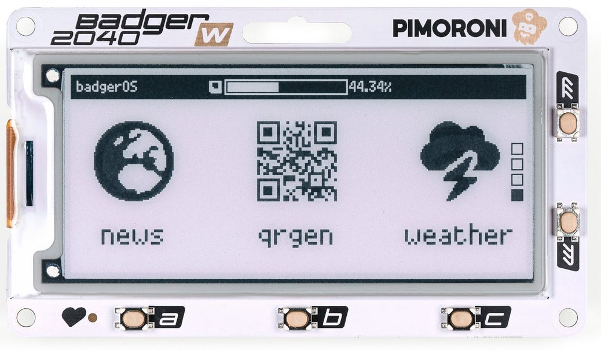

# DeviceScript definitions for Pimoroni Badger RP2040

## Supported devices



https://shop.pimoroni.com/products/badger-2040-w

## Usage

```ts
import { font8, scaledFont } from "@devicescript/graphics"
import { PimoroniBadger2040W } from "devicescript-pimoroni-pico-badger"

const board = new PimoroniBadger2040W()
const disp = await board.startDisplay()
const f = scaledFont(font8(), 3)
disp.image.print("Hello world!", 10, 10, 1, f)
await disp.show()
```
